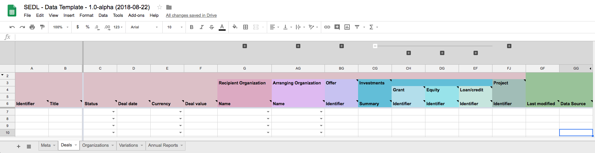

# Data templates

## Spreadsheet template

We have prepared a Google Sheets template to support data entry according to the Social Economy Data Lab Specification. 

You can [find the sheet to view here](https://docs.google.com/spreadsheets/d/1PTu0ziNEmSzDC2oUBtVBP1AXvsW9eLUkX0GfUU5XDqU/edit#gid=968406055) or [make your own copy from this link](https://docs.google.com/spreadsheets/d/1PTu0ziNEmSzDC2oUBtVBP1AXvsW9eLUkX0GfUU5XDqU/copy).



### Spreadsheet features

**Metatab**

The Meta tab provides a space for details of the organisation providing this data, when it was updated, and the license the data is provided under.

**Data validation and codelists**

Fields are set with validation for **dates**, **values** and **codelist values**. Drop-down boxes and date pickers are available for relevant cells.

**Field grouping**

[+] and [-] icons along the top of the screen can be used to show or collapse each section of the data template. For example, if your data does not include deals with equity, the whole equity section can be collapsed. 

**Organisation lookup**

Instead of entering Organization details each time they occur, organization information can be entered on the 'Organization' tab, and then name-based lookup performed each time an organization receives or provides funding. 

**Variation management**

When the template is being used to transcribe historical data, the variation management macros can be used to snapshot the contents of a row, and store a change history. This is useful when you are interested in understanding how a deal has changed over time. 

**Annual report capture**

The Annual Reports tab contains a space to record the annual report details of co-operatives and community benefit societies, and financial figures for any type of entity, drawing on their annual reports.

### Customising the template

If you would like support customising the template to add or remove columns for your use, get in touch with the Social Economy Data Lab.

## JSON template

If you are building a system that will output JSON data, you may find the following blank JSON file useful as a template for preparing your data output.

```json

{
    "deals": [
        {
            "id": "",
            "title": "",
            "status": "",
            "dealDate": "",
            "currency": "",
            "value": ,
            "recipientOrganization": {
                "name": "",
                "id": "",
                "charityNumber": "",
                "companyNumber": "",
                "department": "",
                "contactName": "",
                "streetAddress": "",
                "addressLocality": "",
                "addressRegion": "",
                "addressCountry": "",
                "postalCode": "",
                "telephone": "",
                "alternateName": "",
                "email": "",
                "description": "",
                "organizationType": "",
                "url": "",
                "location": [
                    {
                        "id": "",
                        "name": "",
                        "description": "",
                        "countryCode": "",
                        "geoCode": "",
                        "geoCodeType": "",
                        "latitude": "",
                        "longitude": ""
                    }
                ],
                "dateModified": ""
            },
            "arrangingOrganization": {
                "name": "",
                "id": "",
                "charityNumber": "",
                "companyNumber": "",
                "department": "",
                "contactName": "",
                "streetAddress": "",
                "addressLocality": "",
                "addressRegion": "",
                "addressCountry": "",
                "postalCode": "",
                "telephone": "",
                "alternateName": "",
                "email": "",
                "description": "",
                "organizationType": "",
                "url": "",
                "location": [
                    {
                        "id": "",
                        "name": "",
                        "description": "",
                        "countryCode": "",
                        "geoCode": "",
                        "geoCodeType": "",
                        "latitude": "",
                        "longitude": ""
                    }
                ],
                "dateModified": ""
            },
            "offers": [
                {
                    "id": "",
                    "type": "",
                    "url": "",
                    "offerDocumentUrl": "",
                    "startDate": "",
                    "endDate": "",
                    "minimumInvestmentTarget": ,
                    "investmentTarget": ,
                    "maximumInvestmentTarget": ,
                    "minimumIndividualInvestment": ,
                    "maximumIndividualInvestment": ,
                    "interestRate": {
                        "base": "",
                        "margin": ,
                        "effectiveRate": ,
                        "details": ""
                    },
                    "matchFunding": {
                        "status": "",
                        "details": ""
                    },
                    "withdrawals": [
                        {
                            "start": "",
                            "description": "",
                            "capitalLimit": ""
                        }
                    ],
                    "taxReliefs": [
                        {
                            "type": "",
                            "status": ""
                        }
                    ],
                    "csuStandardMark": {
                        "awarded": "",
                        "practitioner": ""
                    },
                    "crowdfunding": {
                        "platform": "",
                        "url": ""
                    }
                }
            ],
            "investments": {
                "summary": "",
                "grants": [
                    {
                        "id": "",
                        "description": "",
                        "dateOffered": "",
                        "dateAgreed": "",
                        "currency": "",
                        "amountRequested": ,
                        "amountCommitted": ,
                        "amountDisbursed": ,
                        "fundingOrganization": {
                            "name": "",
                            "id": "",
                            "charityNumber": "",
                            "companyNumber": "",
                            "department": "",
                            "contactName": "",
                            "streetAddress": "",
                            "addressLocality": "",
                            "addressRegion": "",
                            "addressCountry": "",
                            "postalCode": "",
                            "telephone": "",
                            "alternateName": "",
                            "email": "",
                            "description": "",
                            "organizationType": "",
                            "url": ""
                        }
                    }
                ],
                "equity": [
                    {
                        "id": "",
                        "description": "",
                        "dateOffered": "",
                        "dateAgreed": "",
                        "currency": "",
                        "value": ,
                        "fundingOrganizations": [
                            {
                                "name": "",
                                "id": "",
                                "charityNumber": "",
                                "companyNumber": "",
                                "department": "",
                                "contactName": "",
                                "streetAddress": "",
                                "addressLocality": "",
                                "addressRegion": "",
                                "addressCountry": "",
                                "postalCode": "",
                                "telephone": "",
                                "alternateName": "",
                                "email": "",
                                "description": "",
                                "organizationType": "",
                                "url": ""
                            }
                        ],
                        "fund": {
                            "code": "",
                            "title": ""
                        }
                    }
                ],
                "credit": [
                    {
                        "id": "",
                        "description": "",
                        "dateOffered": "",
                        "dateAgreed": "",
                        "currency": "",
                        "value": ,
                        "durationInMonths": "",
                        "initialRepaymentHoliday": "",
                        "interestRate": "",
                        "interestPayable": "",
                        "fundingOrganization": {
                            "name": "",
                            "id": "",
                            "charityNumber": "",
                            "companyNumber": "",
                            "department": "",
                            "contactName": "",
                            "streetAddress": "",
                            "addressLocality": "",
                            "addressRegion": "",
                            "addressCountry": "",
                            "postalCode": "",
                            "telephone": "",
                            "alternateName": "",
                            "email": "",
                            "description": "",
                            "organizationType": "",
                            "url": ""
                        }
                    }
                ]
            },
            "projects": [
                {
                    "id": "",
                    "title": "",
                    "description": "",
                    "classification": [
                        {
                            "scheme": "",
                            "code": "",
                            "title": ""
                        }
                    ],
                    "locations": [
                        {
                            "id": "",
                            "name": "",
                            "description": "",
                            "countryCode": "",
                            "geoCode": "",
                            "geoCodeType": "",
                            "latitude": "",
                            "longitude": ""
                        }
                    ],
                    "assets": [
                        {
                            "id": "",
                            "description": "",
                            "type": "",
                            "status": "",
                            "quantity": "",
                            "totalValue": "",
                            "isSecurity": "",
                            "referenceNumbers": ""
                        }
                    ]
                }
            ],
            "dateModified": "",
            "dataSource": ""
        }
    ]
}

```