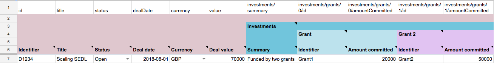
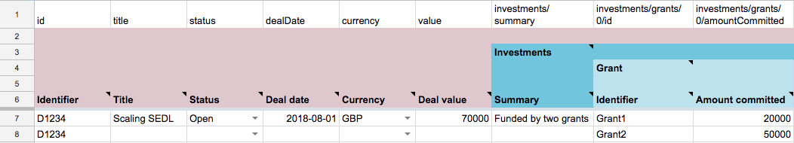

# Flat and structured data

The Social Economy Data Lab Specification uses a **structured data model**. This supports a number of one-to-many relationships: such as when a deal involves multiple grants and loans, or a project is taking place at more than one location. The use of a structured data model aids exchange of data between systems. 

```eval_rst
.. admonition:: Technical note

   In the schema one-to-many relationships are represented using an array. Each item in an array should have a unique ``id`` property.
```

In most cases, however, data entry and data analysis takes place using 'flat' tabular data. For this reason, we have developed tools and templates that can convert between flat and structured data. 

## Worked example

The following table shows a deal with two grants. Here, the special 'array notation' for column headings in the first row of the sheet is used to indicate we have two sets of grant details (grants/0 and grants/1). 



Data in this format may be easier to enter (one row for each deal, repeated columns for each grant). The first row can even be hidden, so the person entering data does not need to worry about the underlying data structure.

However,  data in this format  is more difficult to analyse, as it is no longer possible to get the total value of grants by summing a single column. 

By contrast, if data is presented with repeated rows for each grant, then the grant values can be kept in a single column.



Here, with just the deal identifier repeated in the first column, the Social Economy Data Lab Specification tools can understand that Table A and Table B are both equivalent. In fact, both are converted into exactly the same structured data model:

```json
{
    "deals":[{
        "id":"D1234",
        "title":"Scaling SEDL",
        "status":"Open",
        "dealDate":"2018-08-01",
        "currency":"GBP",
        "value":70000,
        "investments":{
            "summary":"Funded by two grants",
            "grants":[
                {
                    "id":"Grant1",
                    "amountCommitted":20000
                },
                {
                    "id":"Grant2",
                    "amountCommitted":50000

                }
            ]
        }
    }
    ]
}
```

With the appropriate queries, this structure can then be turned back into any number of flat data representations, depending on the purpose to which the data is to be put.

## Take away messages

The Social Economy Data Lab Specification provides an intermediate structure - to convert data into from multiple sources, and from which data can be extracted for analysis. 

It can be used to craft a variety of data input spreadsheets, tailored to particular data collection needs.


```eval_rst
.. admonition:: Technical note
  
  .. markdown::

        The conversion between tabular data and structured JSON is handed by flatten-tool. You can read more in the [flatten-tool spreadsheet designers guide](https://flatten-tool.readthedocs.io/en/latest/unflatten/)
```